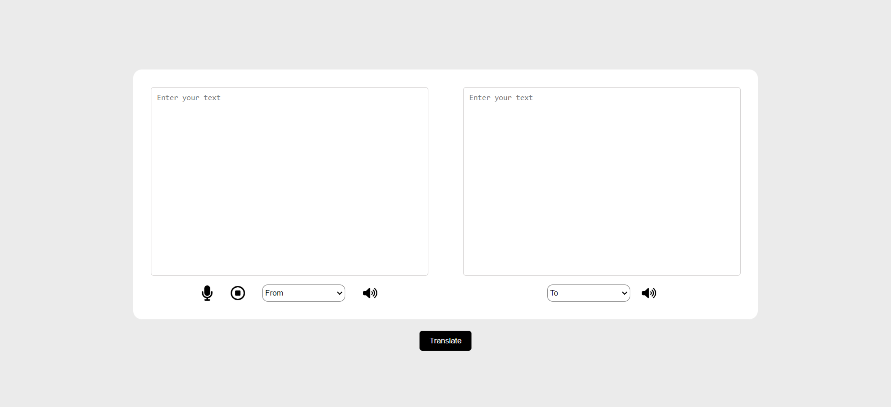

# Translation Application

The Translation Application is a user-friendly tool designed to facilitate seamless text translation between languages with an intuitive interface. Users can input text and select desired languages for translation, benefiting from features like automatic language detection for added convenience. The application also supports speech-to-text integration, enabling users to translate spoken language directly within the UI. Furthermore, it includes text-to-speech functionality for playing back translated content audibly.

## Features

- **Text Translation:** Easily translate text between multiple languages.
- **Speech-to-Text Integration:** Allows users to speak and translate directly within the application.
- **Text-to-Speech Output:** Provides audio playback of translated text for improved accessibility.

## Screenshots

## Deployment Instructions

### Prerequisites
- Node.js
- npm or yarn

### Installation

1. Clone the repository using the command `npm clone https://github.com/astik0398/text-translate.git`
2. Install all the desired dependacies using `npm i`
2. Run the application using the command `npm start`

### Usage

1. Open the application in your web browser.
2. Enter text to translate and select languages.
3. Use speech-to-text for spoken translation.
4. Listen to translated text using text-to-speech functionality.

## Contributing

Contributions are welcome! Please fork the repository and submit a pull request with your improvements.

